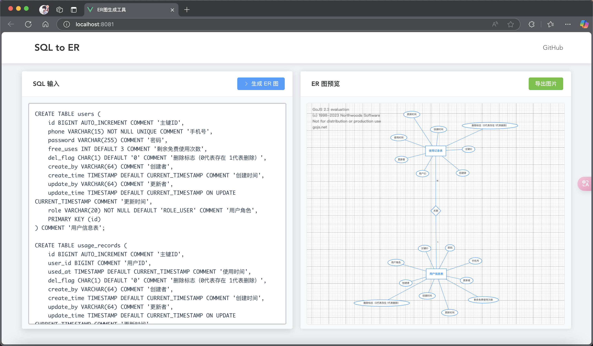

# SQL to ER Diagram Converter

An elegant web application that converts SQL table creation statements into ER diagrams, supporting online editing and exporting. Through a simple interface, easily transform SQL DDL statements into clear Entity-Relationship diagrams.

English | [简体中文](./README.md)

## ✨ Online Demo

[Live Demo](#) // Coming soon

**2025-02-05 **

Display grid, global background, global font, font size, connector color, text color, graphic background, entity background


Demo Screenshot

## 🎯 Core Features

### SQL Parsing
- ✅ Support for standard SQL CREATE TABLE statements
- ✅ Automatic recognition of table names, field names, and field types
- ✅ Smart detection of primary and foreign key relationships
- ✅ Support for batch SQL statement import
- ✅ Parse table and field comments

### ER Diagram Visualization
- ✅ Automatic layout of ER diagrams
- ✅ Visualization of relationships between entity tables
- ✅ Drag and drop support for adjusting diagram positions
- ✅ Zoom and pan operations
- ✅ Multi-select and box selection operations

### Interactive Editing
- ✅ Support for dragging and adjusting entity positions
- ✅ Support for text editing

### Export Features
- ✅ Support for PNG and JPEG format export
- ✅ Support for transparent background export
- ✅ Automatic timestamp filename
- ✅ High-quality image output

## 🚀 Technology Stack

### Frontend (sql-front)
- Framework: Vue 3
- State Management: Vue Composition API
- UI Components: Element Plus
- Graphics Rendering: GoJS
- Code Standards: ESLint + Prettier

### Backend (sql-back)
- Core Framework: Spring Boot 3.x
- Build Tool: Maven
- SQL Parser: Druid SQL Parser
- Development Language: Java 17

## 📦 Installation and Usage

### Requirements
- Node.js 16+
- Java 17+
- Maven 3.6+

### Quick Start

1. Clone the repository
```bash
git clone https://github.com/lbytsl/sql_to_ER.git
```

2. Start frontend
```bash
cd sql-font
npm install
npm run dev
```

3. Start backend
```bash
cd sql-back
mvn spring-boot:run
```

## 📝 License

This project is licensed under the [MIT](LICENSE) License.

## 👨‍💻 Author

Author: [codeMaster]
Email: [1012858748@qq.com]

## 🙏 Acknowledgments

Thanks to these open source projects:

- [Vue.js](https://vuejs.org/)
- [Element Plus](https://element-plus.org/)
- [GoJS](https://gojs.net/)
- [Spring Boot](https://spring.io/projects/spring-boot)

## 📜 Copyright Notice

Copyright © 2025 [codeMaster]

This is an open source project under the MIT License. You are free to use, modify, and distribute this project, provided that you retain the original copyright and license notices.

## Project Structure
```
.
├── sql-back/          # Backend project directory
│   ├── src/          # Source code
│   └── pom.xml       # Maven configuration file
│
├── sql-font/         # Frontend project directory
│   ├── src/         # Source code
│   └── package.json # npm configuration file
│
└── README.md        # Project documentation
```